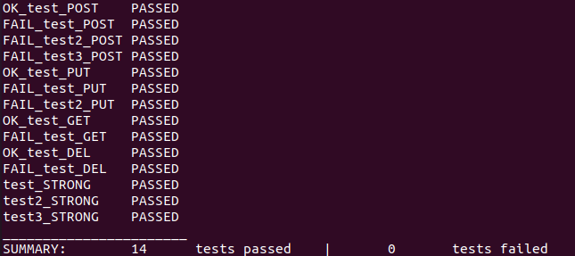

## Тестовое задание
- скачать/собрать тарантул  
- запустить тестовое приложение  
- реализовать kv-хранилище доступное по http  
- выложить на гитхаб  
-* задеплоить где-нибудь в публичном облаке API: 
    - POST /kv body: {key: "test", "value": {SOME ARBITRARY JSON}} 
    - PUT kv/{id} body: {"value": {SOME ARBITRARY JSON}} 
    - GET kv/{id} 
    - DELETE kv/{id} 
    - POST возвращает 409 если ключ уже существует, 
    - POST, PUT возвращают 400 если боди некорректное 
    - PUT, GET, DELETE возвращает 404 если такого ключа нет - все операции логируются

### Справка
Реализованное задание находится в файле [storage.lua](storage.lua)  
Тесты находятся в файле [tests.lua](tests.lua)  
#### Скриншот тестов
  

